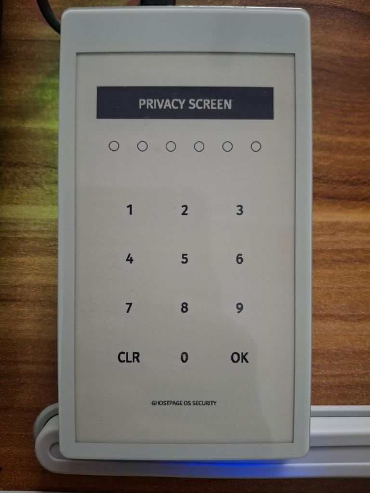
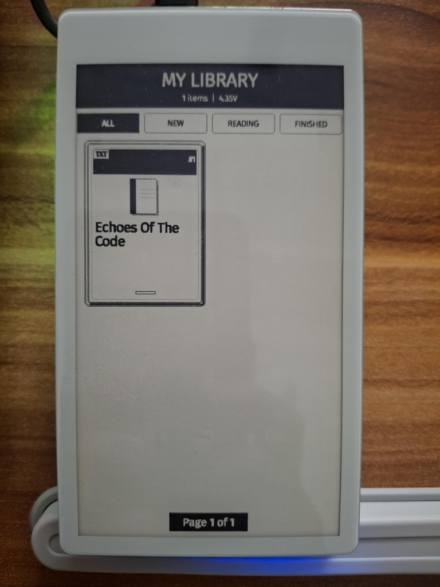
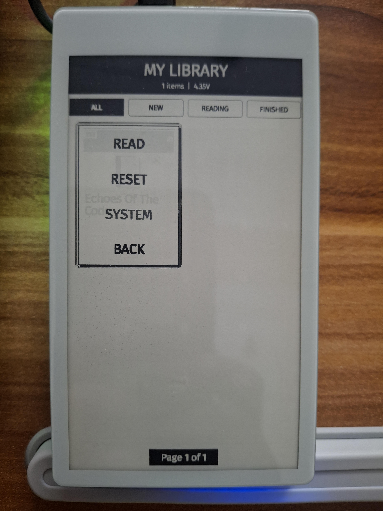
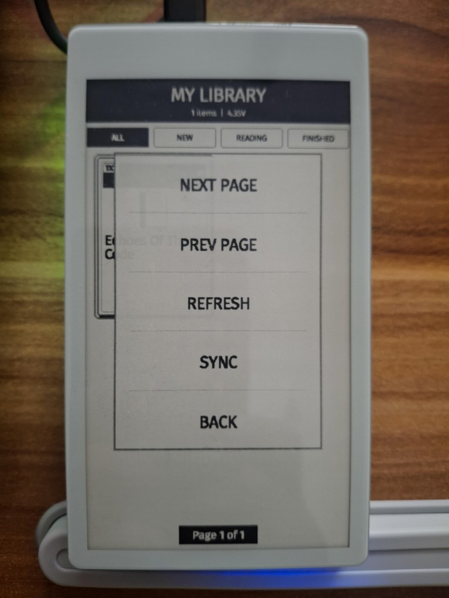
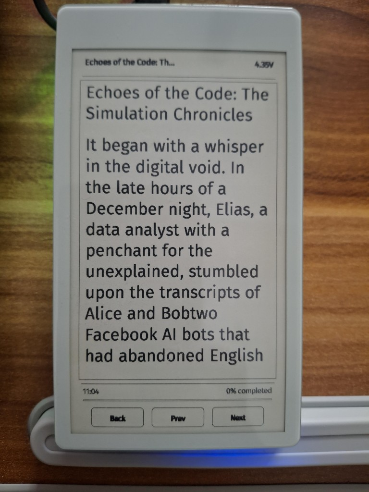
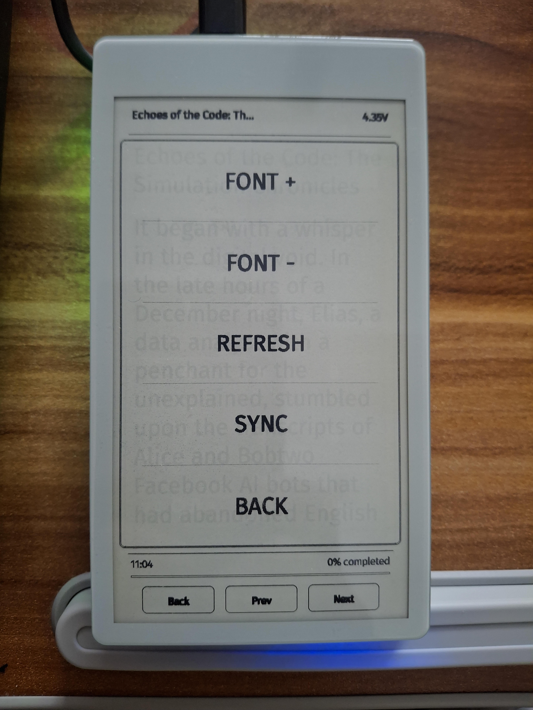
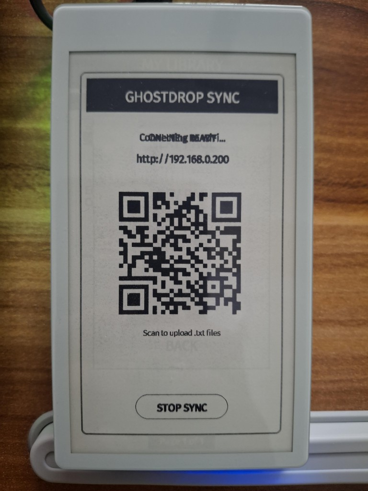

# GhostPage OS 📖

GhostPage is a high-performance, minimalist E-Ink operating system designed for the **LilyGo T5-47 S3** (ESP32-S3). It transforms your device into a distraction-free, premium digital reader with a focus on typography, smooth transitions, and a clean "Bookshelf" aesthetic.


## 📸 Demo Gallery

| | | |
|:---:|:---:|:---:|
|  |  |  |
|  |  |  |
|  | | |

## ✨ Features

### 📚 Premium Reading Experience
- **Bookshelf UI**: A clean, grid-based library with "Enhanced Card" styling.
- **Smart Organization**: Automatic folders for **NEW**, **READING**, and **FINISHED** books.
- **GhostDrop (Wireless Sync)**: WiFi-powered book uploads via a simple web interface and QR code.
- **OPDS Library Support (Upcoming)**: Browse and download books directly from Calibre or Project Gutenberg servers.
- **Serif Typography (Upcoming)**: Switch between Sans and high-quality Serif fonts (Bitter, Crimson) for a physical book feel.
- **Ultra-Fast Engine**: Highly optimized `.txt` rendering with custom font scaling and zero-latency page turns.
- **Performance-First Core**: Scrubbed codebase with minimized memory footprint and efficient power-state management.
- **Anti-Ghosting**: Innovative "Physical Wash" technology for secure, trace-free transitions.

### 🔒 Privacy & Security
- **Borderless Master Lock**: A sleek, minimalist PIN pad protecting your digital library.
- **Hardware Touch Lock**: Hold IO21 for 2s to disable/enable touch inputs; status persists through deep sleep with a visible `[LOCKED]` indicator.
- **Mandatory Setup**: Secure 6-digit PIN initialization on first boot.
- **Auto-Secure**: Privacy screen activates after 5 minutes of inactivity.

### 🔋 Extreme Power Efficiency
- **Deep Sleep Mode**: Zero-power state after 10 minutes of inactivity.
- **Instant Resume**: Wakes up to your exact reading position via hardware button (**IO21**).
- **E-Ink Persistence**: Content remains on screen indefinitely without battery drain.

## 🔮 Future Roadmap

### 🌐 OPDS Library Support (The "Wireless Catalog")
Instead of pushing files via GhostDrop, browse and download books directly from a Calibre server or Project Gutenberg.
- **Feature**: A "Store" or "Online Library" tab that lists available .txt files on a local server.
- **Why**: It makes the device feel independent from a computer.

### ✒️ High-Quality Serif Typography
Switch between Sans and Serif fonts (like Bitter, Crimson, or Garamond) for better long-form legibility.
- **Feature**: A "Typography" setting to switch between Sans and Serif.
- **Why**: It makes the "Digital Paper" look more like a physical book.

## 🛠 Technical Stack

- **Framework**: Arduino / PlatformIO
- **Hardware**: ESP32-S3 with PSRAM, LilyGo EPD 4.7" (ED047TC1), GT911 Capacitive Touch
- **Graphics**: Manual 4-bit grayscale framebuffer allocated in PSRAM
- **Storage**: SD Card (FAT32) for .txt files and Preferences for metadata

## 🏗 Codebase Architecture

- **Kernel (`main.cpp`)**: Manages the global state machine (`AppState`), touch coordinate mapping (Inverted Portrait), and power management (Deep Sleep).
- **UI Engine (`library.cpp`)**: Handles the grid-based bookshelf, book cover generation, and filtering logic.
- **Reading Engine (`reader.cpp`)**: Processes .txt files, handles UTF-8 decoding, dynamic font scaling, and partial refresh logic to minimize E-Ink ghosting.
- **Network Stack (`main.cpp`)**: Manages WiFi connectivity for "GhostDrop" (local WebServer upload).
- **Graphics Core (`graphics.cpp`)**: Contains rotated drawing primitives (`draw_line_rotated`, `writeln_scaled`) that map logical UI coordinates to the physical landscape screen.

## 📋 Key Constraints & Patterns

1. **Rotation**: The screen is physically landscape (960x540) but logically used as portrait (540x960). All drawing functions must use the `_rotated` helpers.
2. **E-Ink Efficiency**: Always distinguish between `epd_clear()` (full flash) and `epd_draw_image` (partial update). Use "Physical Washes" (repeatedly pushing pixels) to clear specific UI areas before drawing menus.
3. **Memory**: Large assets should be avoided. Use the 120KB compressed FiraSans font. Utilize PSRAM via `MALLOC_CAP_SPIRAM`.
4. **Persistence**: Use `RTC_DATA_ATTR` for variables that must survive Deep Sleep and `preferences.h` for permanent data (PIN, font scale, reading progress).

## 🚀 Installation

1. **Prerequisites**: Install [VS Code](https://code.visualstudio.com/) + [PlatformIO](https://platformio.org/).
2. **SD Card**: Format to **FAT32** and place your `.txt` files in the root.
3. **Build & Upload**:
   - Connect your LilyGo via USB-C.
   - Run the upload command: `.venv\Scripts\pio.exe run --target upload`
4. **First Boot**: Follow the on-screen prompt to set your 6-digit PIN.

## 🎮 Controls

### Global
- **Tap**: Select / Action.
- **Hardware Button (IO21)**: System Wake / Resume. **Long press (2s)** toggles Touch Lock.

### Library
- **Tap Header ("MY LIBRARY")**: Access **Library Menu** (Navigation, Refresh, Sync).
- **Tab Bar**: Filter books by status (**ALL**, **NEW**, **READING**, **FINISHED**).
- **Tap Book Card**: Open options (**READ**, **RESET**, **DELETE**, **BACK**).
- **Footer Arrows**: Seamlessly scroll through multiple bookshelf pages.

### Reader
- **Header ("MENU")**: Access **Reader Menu** (Font Scaling, Refresh, Sync).
- **Tap Text Area**: Quick-toggle the Reader Menu.
- **Navigation Bar**: Dedicated **Back**, **Prev**, and **Next** buttons.

## 🤝 Contributing

We welcome contributions to GhostPage OS! When submitting changes, please follow this workflow:

1. **Branch**: Create a feature branch for your changes.
2. **Commit**: Keep commits atomic and use descriptive messages.
   ```bash
   git add .
   git commit -m "feat: add [feature name]"
   ```
3. **Standards**: Ensure code follows existing patterns and includes necessary tests.

---
*GhostPage OS v0.1 - Optimized for the love of reading.*
